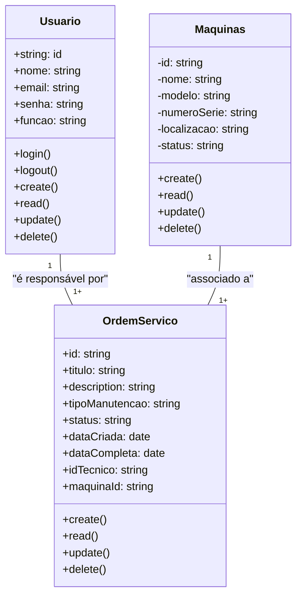

# Sistema de gestão de manutenção (Formativa)

## Briefing

### Visão geral do projeto
O projeto consiste no desenvolvimento de um Sistema de Gestão de Manutenção (SGM) no formato de uma aplicação web.

## Escopo 

- ### Objetivos: 

- ### Público-alvo:
    - Técnicos de manutenção
    - Gestores de manutenção
    - Administradores do sistema

- ### Recursos Tecnológicos:

## Diagramas (Mermaid, Miro, Draw.io)

1. ### Diagrama de classes
Este diagrama modela as principais entidades do sistema:
- Usuários (User/Usuarios);
- Máquinas/Equipamentos (Equipment);
- Ordem de serviço(Service);


### Explicação do diagrama de classe
- Um usuário (técnico) pode ser responsável por várias ordens de serviço

- Um equipamento pode estar associado a várias ordens de serviço

2. ### Diagrama de caso de uso
Ilustrar as interações dos diferentes tipos de usuários (atores) com as funcionalidades do sistema

#### Explicação:
- Atores: Técnico, Gestor, Admin

- Casos de usos:
    - Técnico: Gerenciar ordens de serviço (CRUD) e acessar o dashboard
    - Gestor: Gerenciar ordens de serviço (CRUD), gerenciar equipamentos (CRUD), acessar o dashboard
    - Admin: Gerenciar usuários, acessar o dashboard

    Fazer o login -> Antes de qualquer ação

```mermaid
graph TD
    subGraph "SGM"
        caso1 ([Fazer login])
        caso2 ([Gerenciar ordens de serviço - CRUD])
        caso3 ([Gerenciar equipamentos - CRUD])
        caso4 ([Gerenciar usuários])
        caso5 ([Acessar o dashboard])
    end

    Tecnico([Técnico de manutenção])
    Gestor([Gerente de manutenção])
    Admin([Administrador do sistema])

    Tecnico --> caso1
    Tecnico --> caso3
    Tecnico --> caso5

    Gestor --> caso1
    Gestor --> caso2
    Gestor --> caso3
    Gestor --> caso5

    Admin --> caso1
    Admin --> caso4
    Admin --> caso5

    caso2 -.-> caso1
    caso3 -.-> caso1
    caso4 -.-> caso1
    caso5 -.-> caso1

```