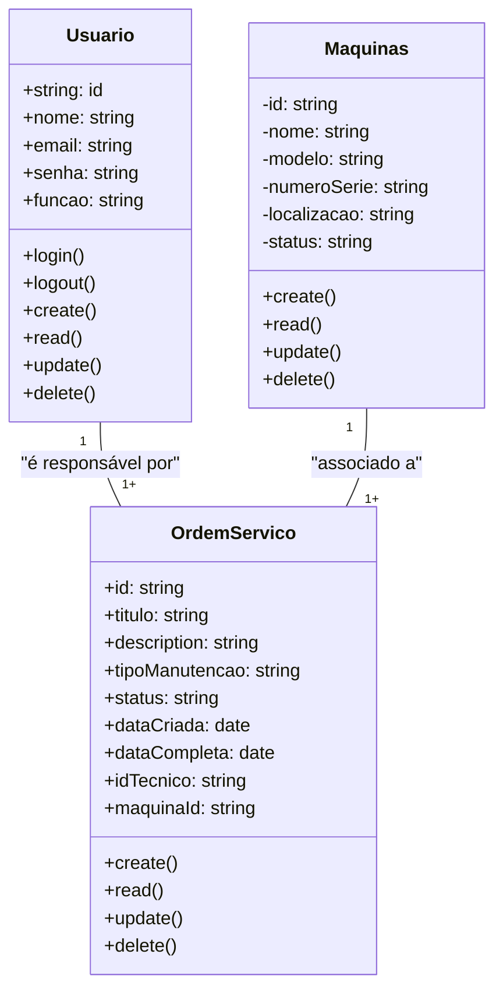

# Sistema de gestão de manutenção (Formativa)

## Briefing

### Visão geral do projeto
O projeto consiste no desenvolvimento de um Sistema de Gestão de Manutenção (SGM) no formato de uma aplicação web.

## Escopo 

- ### Objetivos: 

- ### Público-alvo:
    - Técnicos de manutenção
    - Gestores de manutenção
    - Administradores do sistema

- ### Recursos Tecnológicos:

## Diagramas (Mermaid, Miro, Draw.io)

1. ### Diagrama de classes
Este diagrama modela as principais entidades do sistema:
- Usuários (User/Usuarios);
- Máquinas/Equipamentos (Equipment);
- Ordem de serviço(Service);

