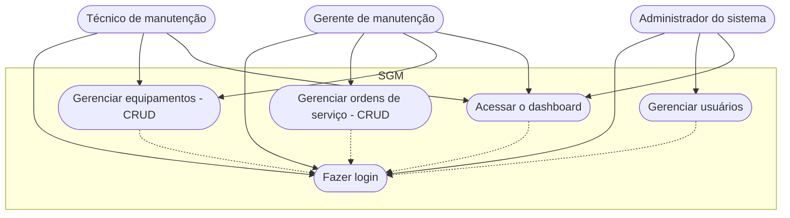

# Sistema de gestão de manutenção (Formativa)

## Briefing

### Visão geral do projeto
O projeto consiste no desenvolvimento de um Sistema de Gestão de Manutenção (SGM) no formato de uma aplicação web.

## Escopo 

- ### Objetivos: 

- ### Público-alvo:
    - Técnicos de manutenção
    - Gestores de manutenção
    - Administradores do sistema

- ### Recursos Tecnológicos:

## Diagramas (Mermaid, Miro, Draw.io)

1. ### Diagrama de classes
Este diagrama modela as principais entidades do sistema:
- Usuários (User/Usuarios);
- Máquinas/Equipamentos (Equipment);
- Ordem de serviço(Service);


### Explicação do diagrama de classe
- Um usuário (técnico) pode ser responsável por várias ordens de serviço

- Um equipamento pode estar associado a várias ordens de serviço

2. ### Diagrama de caso de uso
Ilustrar as interações dos diferentes tipos de usuários (atores) com as funcionalidades do sistema

#### Explicação:
- Atores: Técnico, Gestor, Admin

- Casos de usos:
    - Técnico: Gerenciar ordens de serviço (CRUD) e acessar o dashboard
    - Gestor: Gerenciar ordens de serviço (CRUD), gerenciar equipamentos (CRUD), acessar o dashboard
    - Admin: Gerenciar usuários, acessar o dashboard

    Fazer o login -> Antes de qualquer ação



3. ### Diagrama de fluxo (Login e Acesso ao Dashboard)
Detalhar o passo a passo que um usuário segue para se autenticar no sistema e acessar o dashboard

#### Explicação:
- O fluxo começa quando o usuário acessa a tela de login
- Insere as credenciais(email e senha)
- O sistema verifica se as credenciais são válidas
    - se sim: gera um JWT (token) => dashboard
    - se não: mensagem de erro e usuário permanece na tela de login

```mermaid

graph TD
    A[Início] --> B{Acessa a tela de login}
    B --> C[Preencher email e senha]
    C --> D{Valida as credenciais}
    D --> Sim --> E[Gera um token JWT]
    E --> F[Dashboard]
    D --> Não --> K[Mensagem de erro]
    K --> B