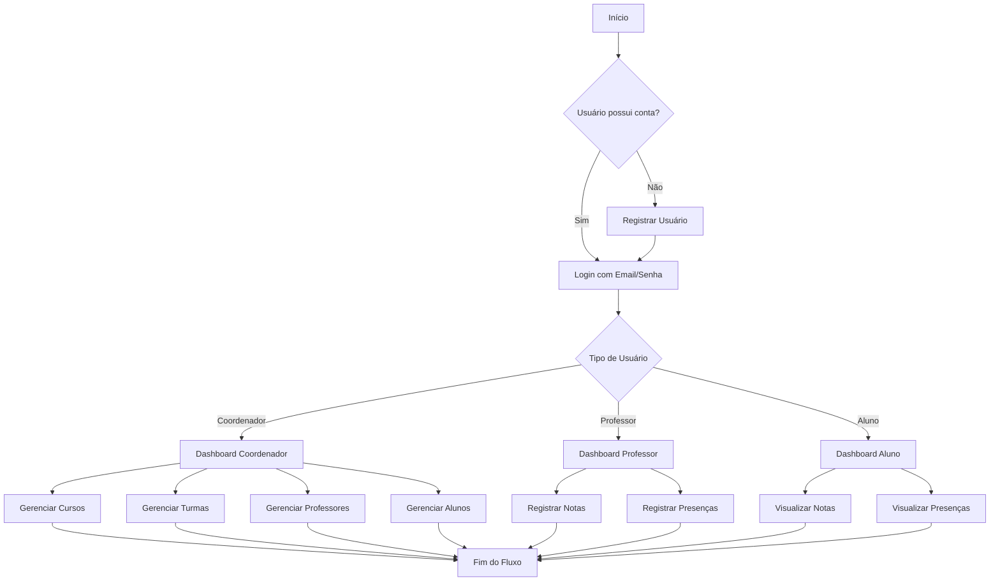

# Sistema de Gestão Acadêmica - Polyglot

## Briefing
### Visão Geral
O **Sistema de Gestão Acadêmica** tem como objetivo modernizar o controle de informações do curso de idiomas *Polyglot*.  
Atualmente, notas e presenças dos alunos são registradas em diários físicos, dificultando o acesso e a centralização de dados pela secretaria.  
A aplicação web busca digitalizar esse processo, oferecendo um ambiente acessível para coordenadores, professores e alunos.

---

## Escopo
### Objetivos
- Desenvolver uma **plataforma web** para gerenciamento acadêmico.
- Permitir **login e autenticação** com diferentes perfis (Coordenador, Professor e Aluno).
- Centralizar o **cadastro de cursos, turmas, professores e alunos**.
- Facilitar o **registro e visualização de notas e presenças**.
- Garantir **usabilidade, segurança e persistência de dados**.

---

## Requisitos

### Requisitos Funcionais

#### Coordenador
- Cadastrar, editar e excluir **cursos, turmas, professores e alunos**.
- Atribuir professores a turmas.
- Visualizar relatórios gerais de desempenho.

#### Professor
- Acessar as turmas sob sua responsabilidade.
- Registrar **notas e presenças** dos alunos.
- Consultar o histórico acadêmico das turmas.

#### Aluno
- Visualizar **notas, presenças e informações da turma**.
- Editar informações básicas do perfil.
- Acompanhar mensagens ou comunicados da coordenação.

#### Sistema
- Controlar o acesso via **login** (com armazenamento local de sessão).
- Redirecionar o usuário para o **dashboard** correspondente ao seu perfil.
- Exibir cabeçalho fixo (header) com navegação e botão de logout.

---

### Requisitos Não Funcionais
- Interface moderna e responsiva (Next.js + CSS).
- Segurança com **LocalStorage** e validação de sessão.
- Navegação dinâmica conforme tipo de usuário.
- Código modular com reutilização de componentes (ex: Header, Formulários).
- Compatibilidade com navegadores modernos.
- Armazenamento persistente de dados (MongoDB).

---

## Recursos

### Recursos Humanos
Projeto desenvolvido em ambiente acadêmico, com papéis definidos:
- **Frontend:** Next.js / React.
- **Backend:** API com Node.js e MongoDB.
- **Design:** Figma (UI/UX das telas).
- **Documentação:** README, diagramas e relatórios técnicos.

### Recursos Tecnológicos
- **Next.js 16+**
- **React Hooks**
- **MongoDB**
- **TypeScript**
- **CSS Modules**
- **Figma**

---

## Diagrama de Fluxo



## Diagrama de classe

```mermaid
classDiagram
    class Usuario {
        +id: number
        +nome: string
        +email: string
        +senha: string
        +funcao: string
        +login() void
        +logout() void
    }

    class Coordenador {
        +gerenciarCursos() void
        +gerenciarTurmas() void
        +gerenciarProfessores() void
        +gerenciarAlunos() void
        +gerarRelatorios() void
    }

    class Professor {
        +registrarNotas() void
        +registrarPresencas() void
        +visualizarTurmas() void
        +consultarAlunos() void
    }

    class Aluno {
        +visualizarNotas() void
        +visualizarPresencas() void
        +editarPerfil() void
        +verComunicados() void
    }

    class Curso {
        +id: number
        +nome: string
        +descricao: string
        +cargaHoraria: number
        +nivel: string
    }

    class Turma {
        +id: number
        +cursoId: number
        +professorId: number
        +horario: string
        +sala: string
        +alunos: Aluno[]
    }

    class Nota {
        +id: number
        +alunoId: number
        +turmaId: number
        +valor: number
        +tipo: string
        +data: Date
    }

    class Presenca {
        +id: number
        +alunoId: number
        +turmaId: number
        +data: Date
        +presente: boolean
    }

    Usuario <|-- Coordenador : extends
    Usuario <|-- Professor : extends
    Usuario <|-- Aluno : extends
    
    Curso "1" --> "N" Turma : contém
    Turma "1" --> "N" Aluno : possui
    Turma "1" --> "1" Professor : ministrada_por
    Aluno "1" --> "N" Nota : possui
    Aluno "1" --> "N" Presenca : possui
    Turma "1" --> "N" Nota : contém
    Turma "1" --> "N" Presenca : contém
    ```
