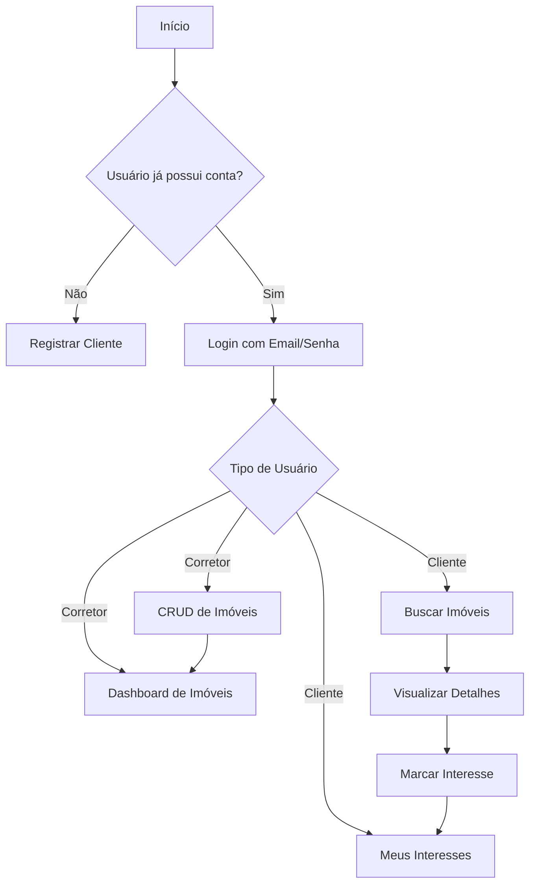
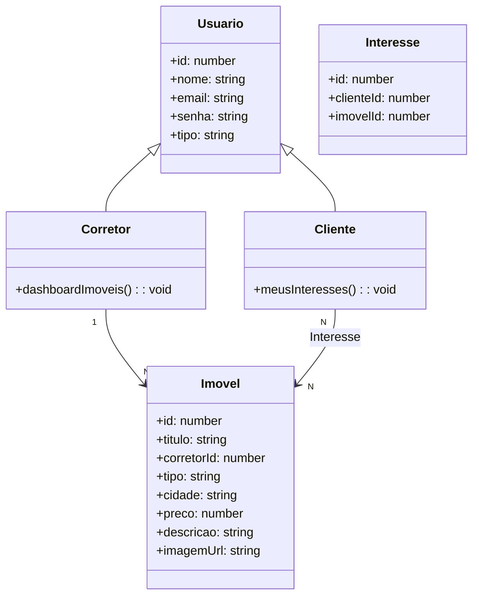

# 🏠 Imobiliária Prime

## Briefing
### Visão Geral

O projeto Imobiliária Prime consiste no desenvolvimento de uma aplicação web para gerenciamento de imóveis, permitindo que clientes e corretores interajam em um ambiente seguro e organizado. A aplicação oferece funcionalidades de cadastro, autenticação baseada em perfis e gerenciamento de interesses em imóveis.

## Escopo
### Objetivos
Criar uma plataforma web responsiva para cadastro e gerenciamento de imóveis.
Permitir login e autenticação com perfis diferenciados (Cliente e Corretor).
Facilitar o contato entre clientes interessados e corretores responsáveis.
Garantir usabilidade, segurança e persistência de dados.
### **Público-Alvo**
**Clientes:** pessoas interessadas em buscar imóveis e marcar favoritos.
**Corretores:** profissionais que anunciam e gerenciam seus imóveis.
**Administrador:** responsável por gerenciar credenciais de corretores.
## Requisitos
### Funcionais
**Visitante:** visualizar imóveis disponíveis e registrar conta como cliente.
**Cliente:** marcar imóveis de interesse, editar perfil e visualizar favoritos.
**Corretor:** CRUD completo de imóveis, dashboard de anúncios e lista de clientes interessados.
### Não-Funcionais
Interface responsiva e intuitiva.
Segurança de acesso com guardas de rota.
Armazenamento de sessão no LocalStorage.
Utilização de tecnologias modernas (Angular, SCSS, Angular Material).
## Recursos
### Recursos Humanos
Projeto desenvolvido de forma individual, com papéis divididos em:
Frontend (Angular)
UI/UX (Figma)
Backend simulado (JSON Server)
Documentação (README, diagramas, relatórios)
### Recursos Tecnológicos
- **Figma** 
- **Angular 16+** 
- **JSON Server** 
- **Reactive Forms**
- **CSS**
- **Guardas**

---

## 📊 Diagrama de Fluxo

## 📊 Diagrama de classes 

